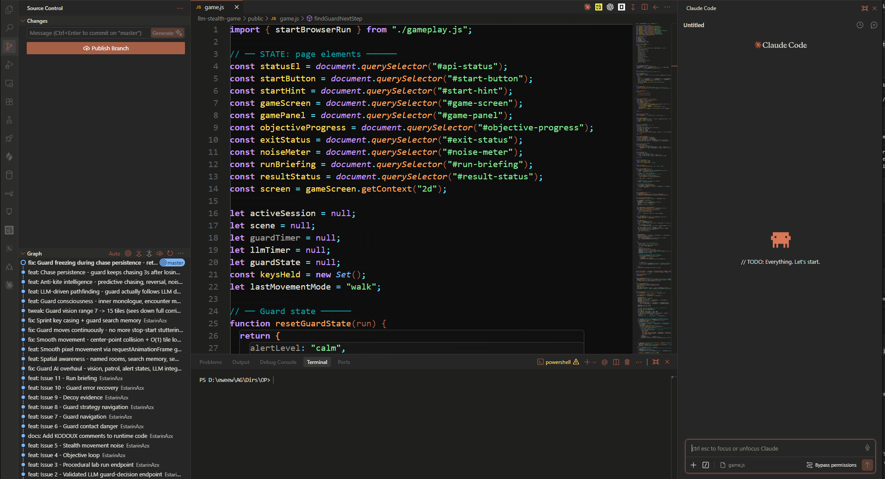

# VS Claude

A warm, Claude.ai-inspired dark theme for VSCode and Antigravity IDE.

Palette extracted directly from the Claude.ai web app: a warm-neutral dark base, muted cream foreground, and a soft terracotta accent.




## Install (Antigravity)

1. Copy the entire `vs-claude` folder into your extensions directory:
   ```
   %USERPROFILE%\.antigravity\extensions\
   ```
2. Restart Antigravity.
3. Open the Color Theme picker: `Ctrl+K`, `Ctrl+T`.
4. Select **VS Claude**.

## Install (VSCode)

Same steps but use:
```
%USERPROFILE%\.vscode\extensions\
```

## Palette

| Role | Hex |
|---|---|
| Main background (editor, terminal, status bar) | `#1F1F1E` |
| Sidebar / panels / inputs | `#262626` |
| Section headers / title bar / activity bar | `#2C2C2A` |
| Borders | `#3A3733` / `#403D38` |
| Primary text | `#E2E1DA` |
| Muted text | `#8F8D83` |
| Accent (focus, button, badge, cursor, errors) | `#A65F47` |

## License

MIT
