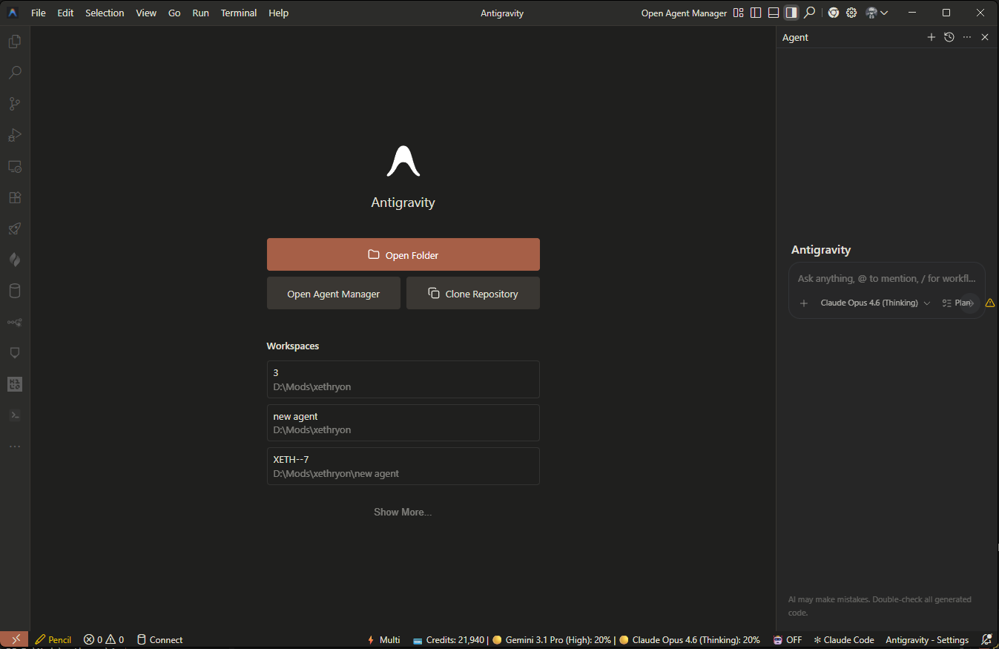
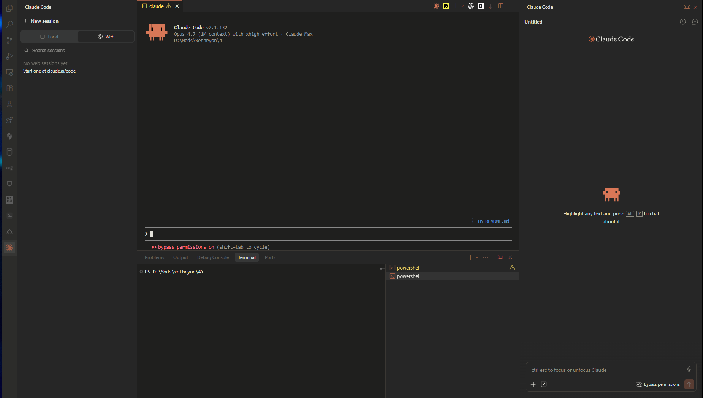

# VS Claude

A warm, Claude.ai-inspired dark theme for VSCode and Antigravity IDE.

Palette extracted directly from the Claude.ai web app: a warm-neutral dark base, muted cream foreground, and a soft terracotta accent.






### From VSIX (Recommended)

1. Download `vs-claude.vsix` from the [Releases](../../releases/latest) page.
2. Install via the command line:
   ```
   # Antigravity
   antigravity --install-extension vs-claude.vsix

   # VSCode
   code --install-extension vs-claude.vsix
   ```
   Or install from the IDE: open the Command Palette (`Ctrl+Shift+P`), run **Extensions: Install from VSIX...**, and select the downloaded file.
3. Open the Color Theme picker (`Ctrl+K`, `Ctrl+T`) and select **VS Claude**.

## Install Manually (Antigravity)

1. Download or clone this repo.
2. Copy the `vs-claude/` folder (the one inside this repo, not the repo root) into your extensions directory:
   ```
   %USERPROFILE%\.antigravity\extensions\
   ```
3. Restart Antigravity.
4. Open the Color Theme picker: `Ctrl+K`, `Ctrl+T`.
5. Select **VS Claude**.

## Install Manually (VSCode)

Same steps but use:
```
%USERPROFILE%\.vscode\extensions\
```

## Palette

| Role | Hex |
|---|---|
| Main background (editor, terminal, status bar) | `#1F1F1E` |
| Sidebar / panels / inputs | `#262626` |
| Section headers / title bar / activity bar | `#2C2C2A` |
| Borders | `#3A3733` / `#403D38` |
| Primary text | `#F6F6F4` |
| Muted text | `#8F8D83` |
| Accent (focus, button, badge, cursor, errors) | `#A65F47` |

## License

MIT
